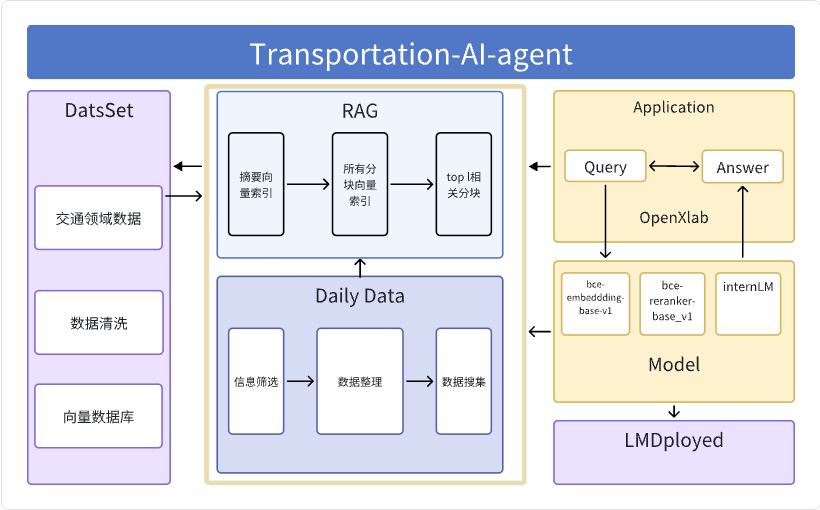

# Transportation-AI-Agent: 基于 InternLM 的交通 AI 智能体

## 项目简介

欢迎来到 Transportation-AI-Agent，这是一个基于 InternLM 构建的交通领域 AI 智能体项目！ 🎉  本项目诞生于书生大模型实战营 (https://github.com/internLM/tutorial) ，旨在为广大土木老哥提供一个便捷、高效的知识问答和信息获取平台。 Transportation-AI-Agent  是一个能够通过交互慢慢学习的“自我成长智能体”，具备专业知识问答、每日最新资讯摘要、“标题党退散” 三大功能，帮助您在工作和学习中快速解决问题、提升效率。

## 交通智能体大模型

本 AI 智能体主要基于交通领域的资讯、论文数据集进行训练，致力于解决土木工程从业者在工作中遇到的实际问题：

- **场景一：专业术语 & 行业黑话**: 传统道路基础设施各个部件常常存在各种俚语和行业黑话，例如“牛腿”、“马腿”、“浅水泵”等等。这些专业术语对于刚入行的新人来说可能难以理解，资深工程师也可能因为地域或习惯差异而产生误解。 Transportation-AI-Agent  为您提供专业术语和行业黑话的精准解释，帮助您快速理解行业术语，避免沟通障碍。 
- **场景二：高效识别“标题党”**:  现实生活中充斥着大量“标题党”文章，这些文章为了吸引眼球，往往标题与内容严重不符，浪费读者时间。 Transportation-AI-Agent  的“标题党退散”功能，可以自动分析文章标题与内容的匹配度，帮助您快速识别“标题党”文章，节省宝贵时间。
- **场景三：轻松掌握行业资讯**:  为了帮助您在繁忙的工作中轻松学习， Transportation-AI-Agent  提供每日资讯推送功能，根据您设定的偏好领域，为您精选业内最新资讯，让您在碎片化时间掌握行业动态。

## 功能点总结

1. **俚语同义词与定义翻译**:  快速查询交通工程领域专业术语和行业黑话的释义。
2. **文档与标题匹配度分析（标题党退散）**:  自动识别“标题党”文章，提高信息获取效率。
3. **Agent 每日关注资讯自动推送**:  根据用户偏好，推送精选的行业最新资讯。
4. **自我成长的AI智能体**:  通过与用户不断交互，学习和完善知识库，提供更精准的服务。

##  技术栈
- streamlit
- InternLM
- Chroma
- Python

